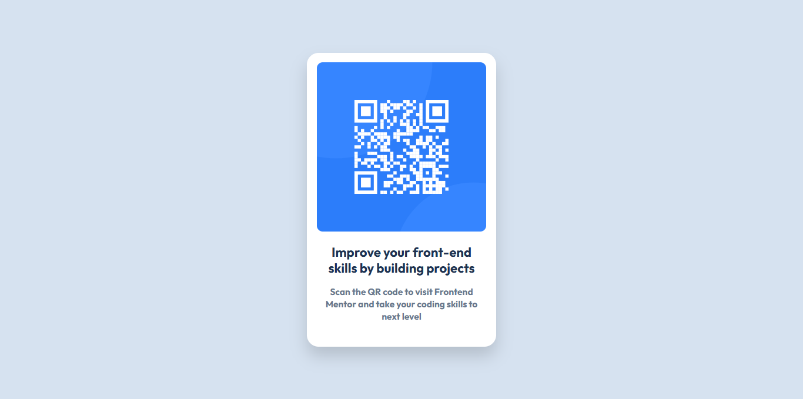

# Frontend Mentor - QR code component solution

This is a solution to the [QR code component challenge on Frontend Mentor](https://www.frontendmentor.io/challenges/qr-code-component-iux_sIO_H). Frontend Mentor challenges help you improve your coding skills by building realistic projects.

## Table of contents

- [Overview](#overview)
  - [Screenshot](#screenshot)
  - [Links](#links)
- [My process](#my-process)
  - [Built with](#built-with)
  - [What I learned](#what-i-learned)
  - [Continued development](#continued-development)

**Note: Delete this note and update the table of contents based on what sections you keep.**

## Overview

### Screenshot

### Links

- Solution URL: [https://github.com/Mohammed-Osama-pg/FdMr-QR-code-component.git](https://github.com/Mohammed-Osama-pg/FdMr-QR-code-component.git)
- Live Site URL: [https://mohammed-osama-pg.github.io/FdMr-QR-code-component/](https://mohammed-osama-pg.github.io/FdMr-QR-code-component/)

## My process

### Built with

- Semantic HTML5 markup
- CSS custom properties
- Flexbox

### What I learned

test my ability to use frontend mentor and git

### Continued development

Rebuild the website by SAAS framework
